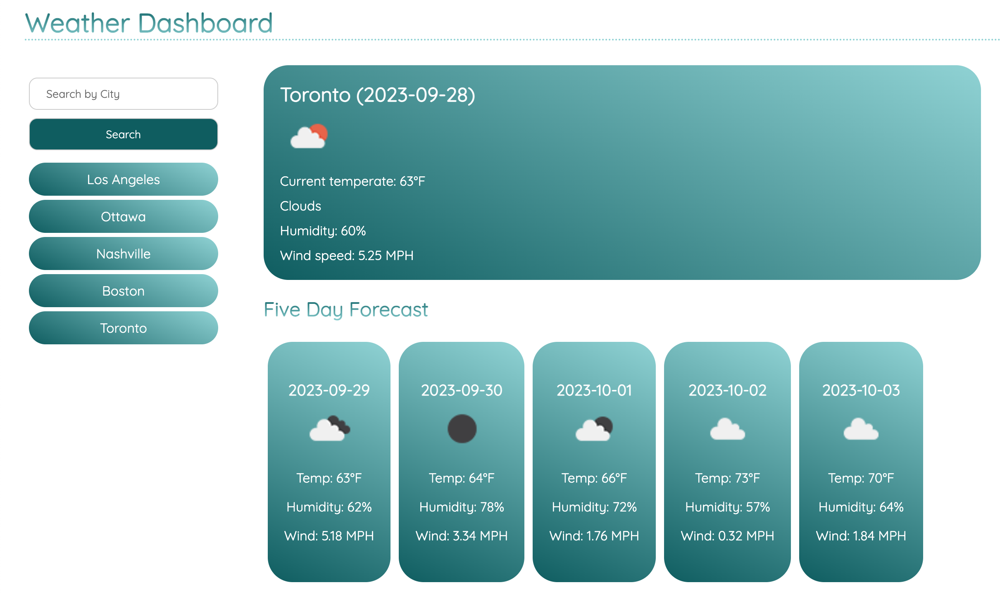

# Weather Dashboard

## UCLA Bootcamp Module 6 Assignment

## Description

This website is a weather dashboard. The user will be able to:

1. Search for a city
2. See the current weather for the city, as well as the weather for the next five days
3. See the city name, date, temperature, weather description, weather icon, humidity and wind speed.
4. Click a recent search and see the weather for that city.

## Installation

This project can be accessed via Github Pages at https://ramitaarora.github.io/weather-dashboard/.

## Usage

## Credits

This website was created by Ramita Indurkhya.